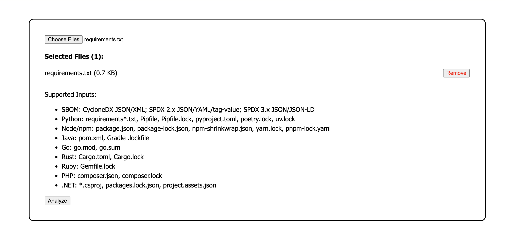
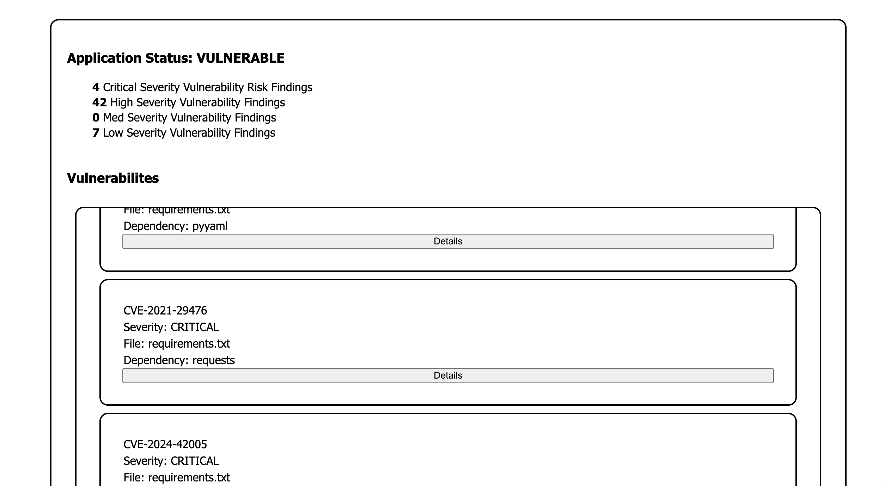
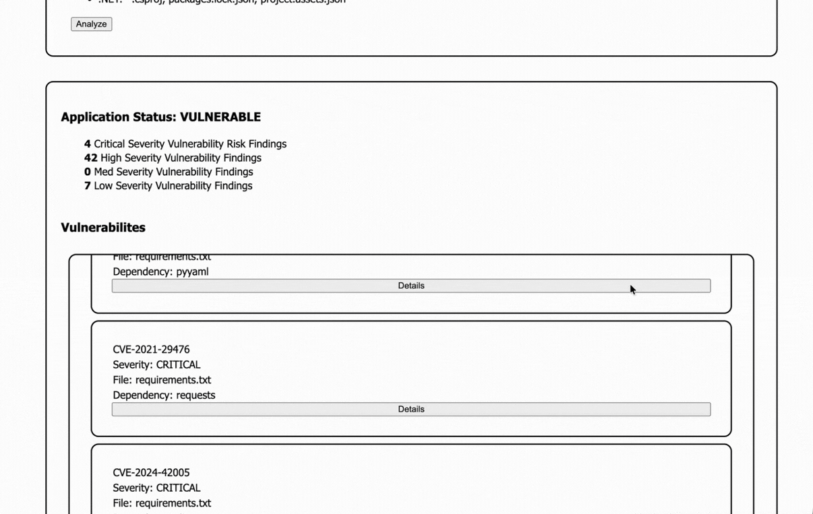

# CVE Security Platform UI

This project is a low fidelity functional UI for the Application Cybersecurity CVE scanner.
It allows developers to scan a variety of project configuration files to determine if thier application dependencies and third party libraries contain known vulnerabilities and exposures. 

The server/backend application, and instructions to build and run it with docker can be found in the [CVE Security Platform Repository](https://github.com/kfemelue/cve-security-platform)

## Tech stack
The application is built with React/Javascript and uses Vite as a build tool.
An updated version of NodeJS is required to run the app in a local development server.

To run the app locally:

1. Clone the repository
2.  cd into it
3. run `npm install`
4. Start the app with `npm run dev` and navigate to http://localhost:5173 in the web browser of your choice.

Using the app is simple. 

First, you upload a project configuration file for example a package.json file from a nodejs project, or requirements.txt file from a python project. 

Then the application returns an overview of known vulnerability risks associated with your app's dependencies.

## In Progress

I'm working on attaching a modal view to each vulnerability that appears in the report. The modal view will have additional details on each vulnerability.

Remediation steps and strategies for each vulnerability can be added further down the roadmap

## Demo
<!-- 
 -->

